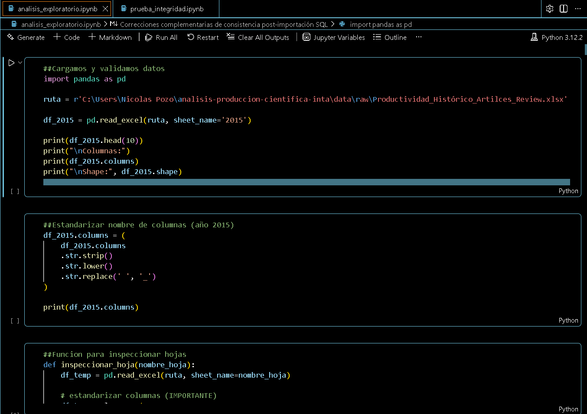
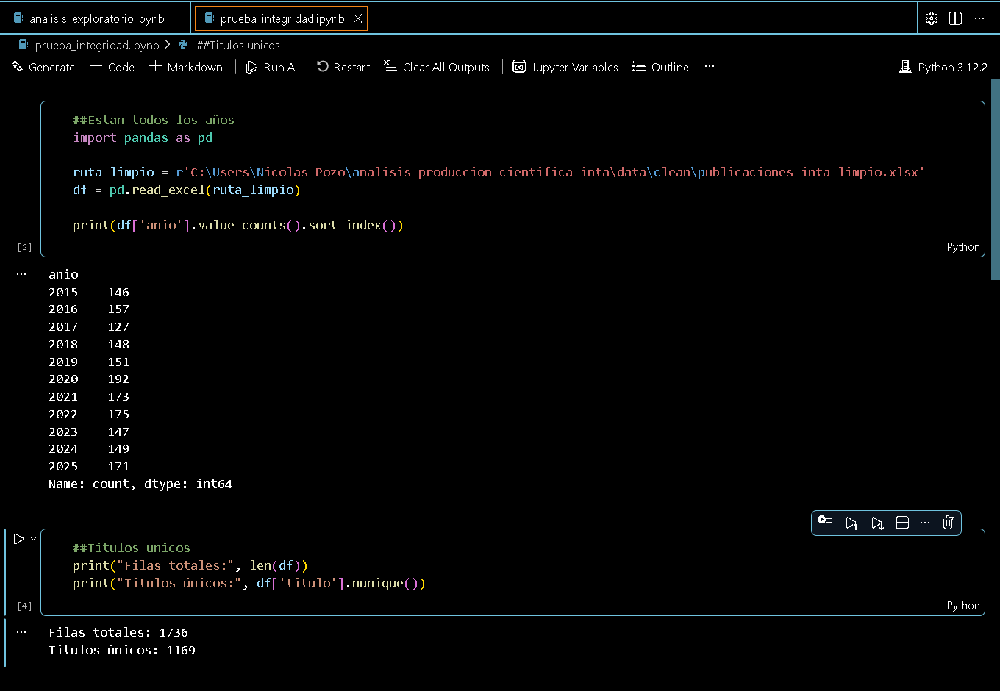
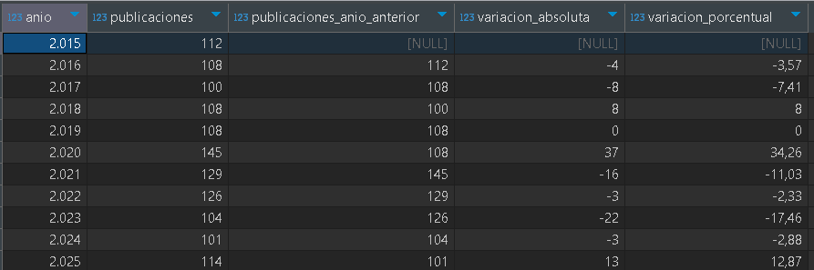
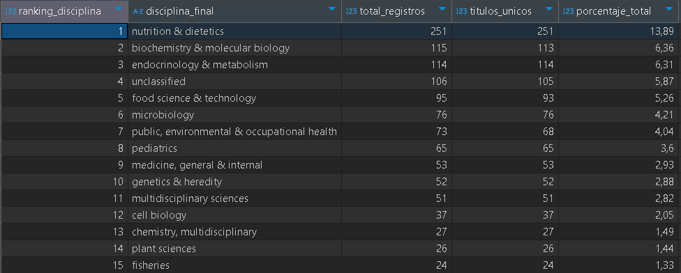
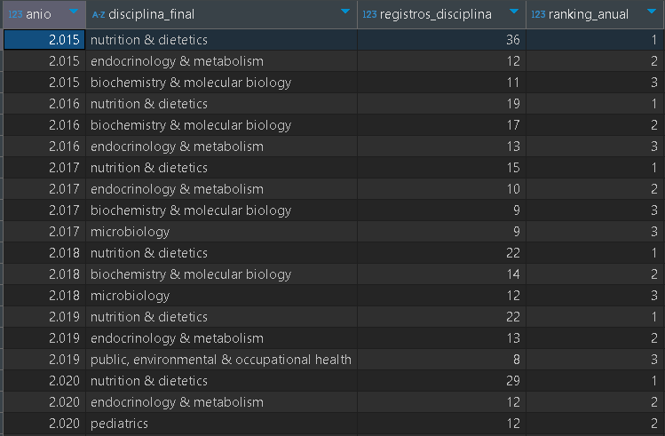
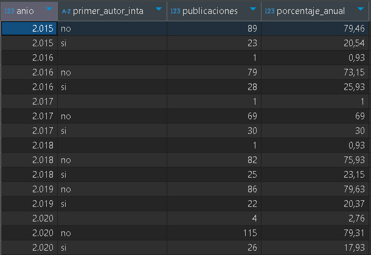
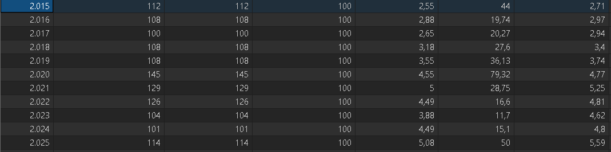
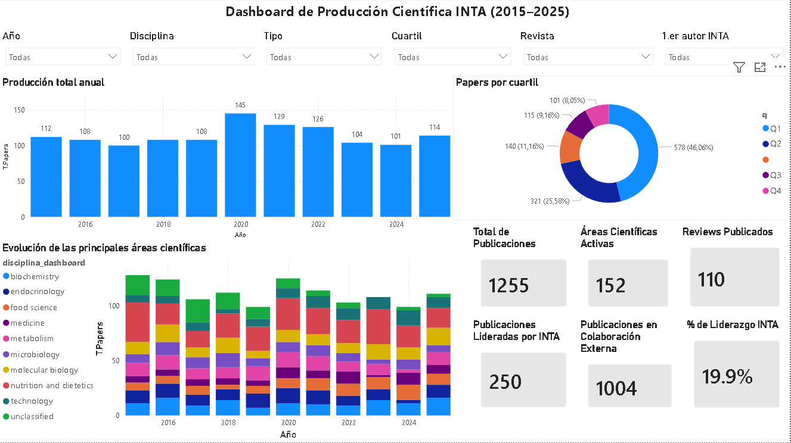

# Análisis de Producción Científica INTA (2015–2025)

## Descripción del proyecto

Este proyecto analiza la producción científica del Instituto de Nutrición y Tecnología de los Alimentos (INTA) entre los años 2015 y 2025.

El objetivo fue transformar una base histórica institucional, compuesta por múltiples hojas Excel y estructuras inconsistentes, en un flujo completo de análisis de datos, incluyendo limpieza, validación, análisis SQL y visualización interactiva en Power BI.

El proyecto simula un flujo de trabajo real de analista de datos, abordando problemas frecuentes como datos incompletos, columnas con nombres inconsistentes, duplicación de registros, múltiples categorías por publicación y recuperación de información perdida.

---

## Objetivos

- Analizar la evolución anual de la producción científica INTA.
- Identificar las principales áreas científicas activas.
- Evaluar la distribución de publicaciones por cuartil.
- Analizar liderazgo institucional mediante primer autor INTA.
- Diferenciar publicaciones lideradas por INTA y publicaciones en colaboración externa.
- Construir un dashboard interactivo en Power BI.
- Documentar el proceso completo como proyecto profesional de portafolio.

---

## Herramientas utilizadas

- **Python**
  - pandas
  - numpy
  - Jupyter Notebook

- **SQL**
  - SQLite
  - DBeaver

- **Power BI**

- **Git & GitHub**

---

## Pipeline del proyecto

```text
Excel histórico institucional
        ↓
Limpieza y consolidación en Python
        ↓
Validación de integridad de datos
        ↓
Análisis exploratorio con SQL
        ↓
Dashboard interactivo en Power BI
        ↓
Documentación y publicación en GitHub
```

---

## Limpieza y transformación de datos

La base original estaba compuesta por hojas anuales entre 2015 y 2025, con diferencias estructurales entre años.

Durante la limpieza se realizaron tareas como:

- carga de múltiples hojas Excel
- corrección especial de la hoja 2020
- normalización de nombres de columnas
- consolidación de columnas equivalentes
- tratamiento de valores nulos
- limpieza de disciplinas múltiples
- separación de categorías en filas individuales
- validación de títulos únicos
- recuperación de información perdida
- preparación de datos para SQL y Power BI

Uno de los principales desafíos fue la existencia de columnas con nombres distintos según el año, por ejemplo:

```text
titulo_revista
REVISTA
Revista
```

También se detectaron columnas con errores de escritura, como variaciones en el campo de primer autor INTA. Estos problemas fueron corregidos mediante procesos de validación, recuperación parcial y merges correctivos en Power BI.

---

# Evidencia de limpieza y validación en Python

## Limpieza de datos



## Validación de integridad



---

# Consultas SQL

Se realizaron consultas SQL para validar y analizar los datos desde distintas perspectivas.

Las consultas desarrolladas incluyen:

- auditoría general
- producción anual
- ranking de disciplinas
- top disciplinas por año
- liderazgo institucional
- factor de impacto anual
- distribución por cuartiles

---

## Producción anual



---

## Ranking de disciplinas



---

## Top disciplinas por año



---

## Liderazgo institucional INTA



---

## Impacto anual



---

# Dashboard Power BI

Se construyó un dashboard interactivo para explorar la producción científica INTA desde distintas dimensiones:

- año
- disciplina
- tipo de documento
- cuartil
- revista
- primer autor INTA

El dashboard permite analizar dinámicamente:

- producción total anual
- evolución de principales áreas científicas
- distribución por cuartil
- total de publicaciones
- áreas científicas activas
- reviews publicados
- publicaciones lideradas por INTA
- publicaciones en colaboración externa
- porcentaje de liderazgo INTA

---

## Dashboard final



---

# Hallazgos principales

## 1. Evolución de la producción científica

La producción científica de INTA entre 2015 y 2025 muestra un comportamiento relativamente estable, con variaciones moderadas entre años.

Se observa un peak de publicaciones en el año 2020, alcanzando el mayor volumen del periodo analizado. Este aumento podría estar asociado al contexto global de investigación durante la pandemia, especialmente en áreas vinculadas a salud, nutrición, metabolismo y ciencias biomédicas.

---

## 2. Presencia relevante de publicaciones Q1

La distribución por cuartiles muestra una presencia importante de publicaciones Q1, lo que indica que una proporción significativa de la producción científica fue publicada en revistas de alto impacto dentro de sus respectivas áreas.

Esto sugiere una orientación sostenida hacia publicaciones de mayor calidad y visibilidad académica.

---

## 3. Concentración en áreas científicas clave

Las principales áreas científicas identificadas están relacionadas con:

- nutrición
- bioquímica
- endocrinología
- metabolismo
- medicina
- ciencias de los alimentos

Esto es coherente con el perfil institucional de INTA y su foco en nutrición, salud, alimentos y ciencias biomédicas.

---

## 4. Alta diversidad disciplinaria

El análisis identifica más de 150 áreas científicas activas, lo que evidencia una producción científica amplia y multidisciplinaria.

Esta diversidad muestra que la actividad investigativa no se limita a una sola línea, sino que integra múltiples áreas relacionadas con salud, nutrición, biomedicina, tecnología de alimentos y ciencias aplicadas.

---

## 5. Liderazgo institucional y colaboración externa

El análisis de primer autor INTA permitió diferenciar publicaciones lideradas directamente por investigadores INTA y publicaciones desarrolladas en colaboración externa.

Se observa una presencia relevante de publicaciones en colaboración externa, lo que puede interpretarse como evidencia de redes científicas amplias y trabajo conjunto con otras instituciones.

Al mismo tiempo, las publicaciones lideradas por INTA permiten medir la capacidad institucional de conducción científica propia.

---

## 6. Predominio de investigación original

La mayoría de las publicaciones corresponde a artículos científicos originales, mientras que los reviews representan una proporción menor del total.

Esto sugiere una fuerte orientación hacia la generación de investigación original, sin dejar de lado publicaciones de revisión que aportan valor estratégico en áreas específicas.

---

# Problemas detectados y soluciones implementadas

Durante el desarrollo del proyecto se detectaron múltiples problemas reales de calidad de datos:

- columnas con nombres inconsistentes entre años
- datos faltantes en campos clave
- filas corruptas en hoja 2020
- disciplinas duplicadas o concatenadas
- columnas equivalentes con nombres distintos
- pérdida parcial de información durante la consolidación
- necesidad de recuperar datos desde el Excel original

Para resolver estos problemas se aplicaron estrategias como:

- normalización de nombres de columnas
- validación por año
- recuperación parcial de datos
- merges correctivos en Power BI
- separación de disciplinas múltiples
- uso de conteos distintos por título para evitar duplicidad analítica

---

# Estructura del proyecto

```text
analisis-produccion-cientifica-inta/
│
├── data/
│   └── sample/
│
├── imagenes/
│   ├── 01_sql_produccion.PNG
│   ├── 02_sql_top_disciplinas.PNG
│   ├── 03_sql_top3_anual.PNG
│   ├── 04_sql_liderazgo_inta.PNG
│   ├── 05_sql_impacto_anual.PNG
│   ├── 06_powerbi_dashboard.PNG
│   ├── 07_python_limpieza.PNG
│   └── 08_python_integridad.PNG
│
├── notebooks/
│
├── powerbi/
│   └── dashboard-inta.pbix
│
├── sql/
│   ├── 01_auditoria_general.sql
│   ├── 02_produccion_anual.sql
│   ├── 03_ranking_disciplinas.sql
│   ├── 04_top3_disciplinas_anual.sql
│   ├── 05_primer_autor_inta.sql
│   ├── 06_factor_impacto_anual.sql
│   └── 07_distribucion_cuartiles.sql
│
├── README.md
└── .gitignore
```

---

# Consideraciones de privacidad

El dataset original contiene información institucional, por lo que no se publica completo en este repositorio.

Para mantener buenas prácticas de gobernanza de datos:

- se excluyeron archivos originales y limpios mediante `.gitignore`
- no se suben bases SQLite locales
- se mantiene solo una muestra pública en `data/sample/`
- el dashboard y las evidencias visuales se publican como parte del portafolio

---

# Conclusión

Este proyecto permitió desarrollar un flujo completo de análisis de datos aplicado a un caso institucional real.

El trabajo incluyó limpieza de datos, validación, análisis SQL, recuperación de información perdida, normalización de categorías y construcción de un dashboard interactivo en Power BI.

Más allá de la visualización final, el valor principal del proyecto está en el proceso de transformación de una base histórica compleja en un modelo analítico útil para explorar tendencias, calidad científica, liderazgo institucional y distribución disciplinaria.

---

# Autor

**Nicolas Pozo**  
Proyecto de portafolio orientado a análisis de datos, SQL, Python y Power BI.